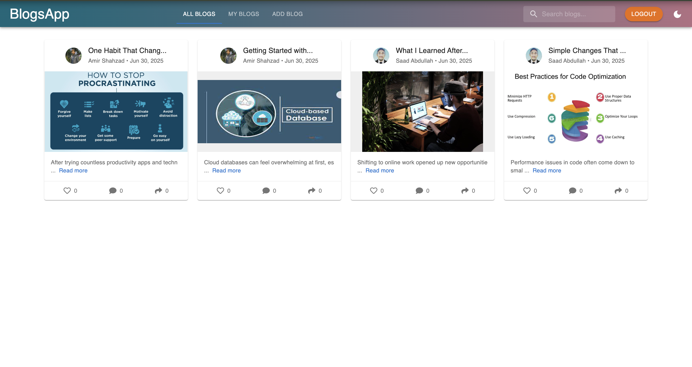
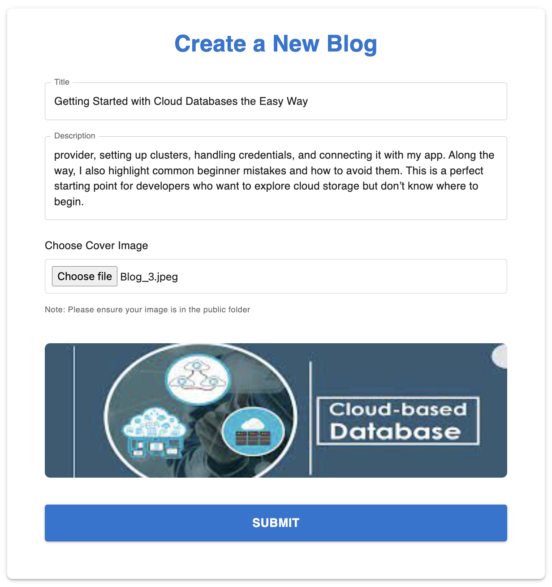
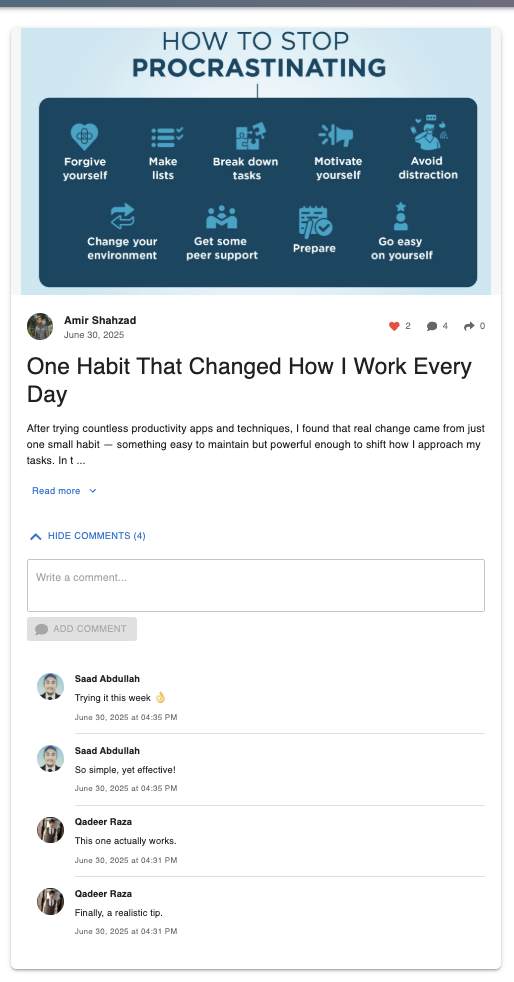
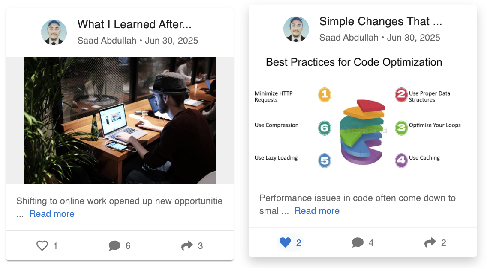
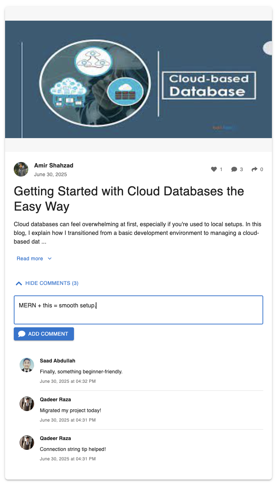
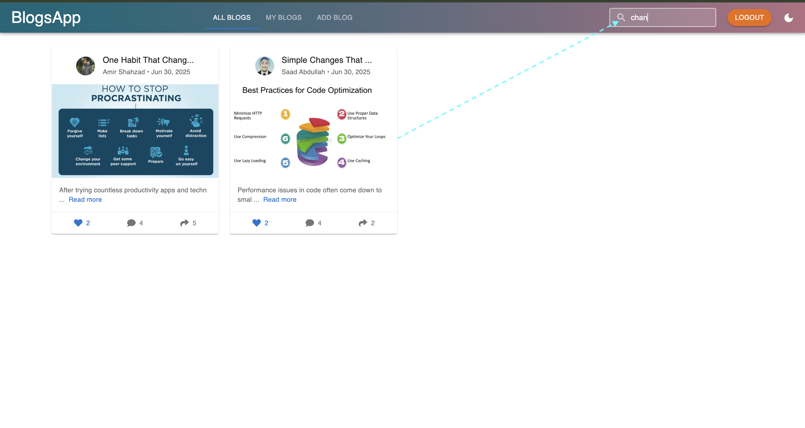
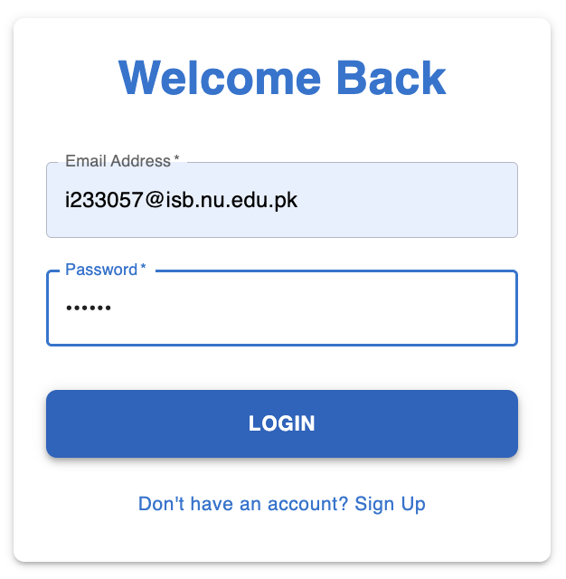
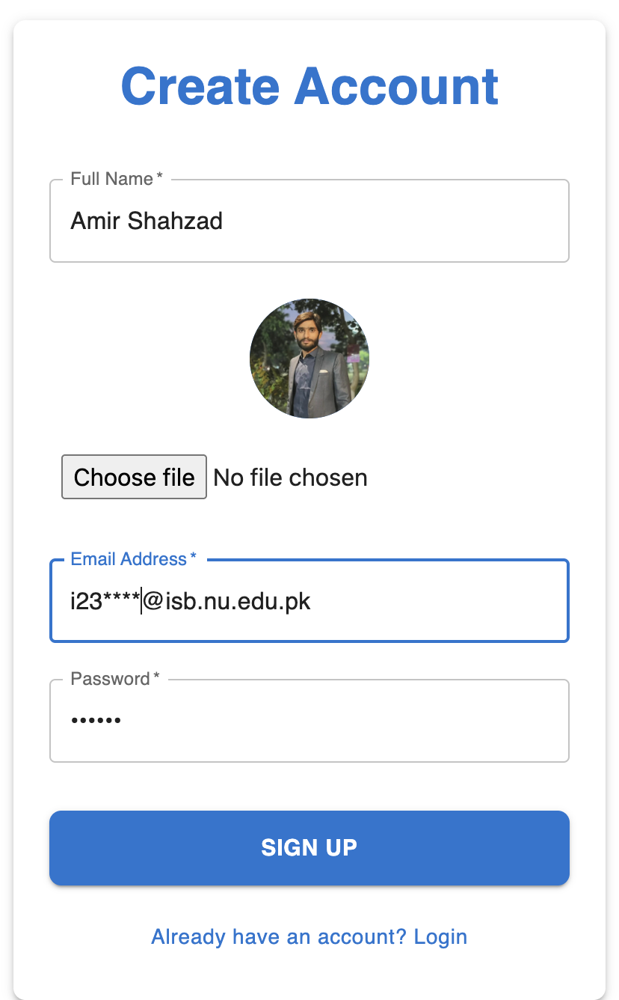

# 📝 MERN Stack Blog Application

A modern, full-stack blogging platform built with the MERN (MongoDB, Express.js, React.js, Node.js) stack. Share your thoughts, connect with others, and explore a world of diverse content.

## 📸 Screenshots

### Home Page

*Browse through a collection of blogs on our modern and intuitive home page*

### Blog Creation

*Create and publish your blogs with our user-friendly editor*

### Blog Details

*View detailed blog posts with rich content and interactions*

### Blog Card

*Attractive blog cards displaying key information*

### Comments Section

*Engage with other users through comments on real Time*

### Search Functionality

*Find blogs easily with our powerful search feature*

### Authentication

*Secure login page for users*

*New user registration with profile customization*

## ✨ Features

- 🔐 **Secure Authentication**: User registration and login system with encrypted passwords
- 📝 **Blog Management**: Create, read, update, and delete blog posts
- 👍🏻 **Interaction**: Users can like, comment, share and search for all avalilable blogs.
- 👤 **User Profiles**: Customizable user profiles with avatar support
- 🖼️ **Rich Media Support**: Upload and manage images in your blog posts
- 🎨 **Modern UI/UX**: Responsive design with Material-UI components
- 🌓 **Dark Mode**: Toggle between light and dark themes

## 🛠️ Tech Stack

- **Frontend**: React.js, Redux Toolkit, Material-UI
- **Backend**: Node.js, Express.js
- **Database**: MongoDB
- **Authentication**: JWT, bcrypt
- **Deployment**: Docker support
- **Other Tools**: Axios, React Router

## 🤝 Let's Connect!

I'm always interested in connecting with fellow developers and users. Feel free to reach out:

---

⭐ If you find this project helpful, please consider giving it a star!
